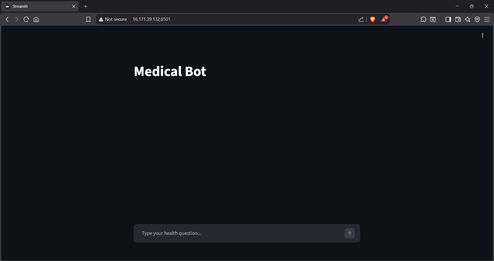
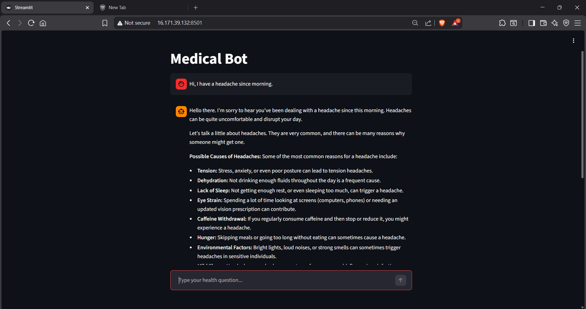

# MediGuide-Chatbot
A simple medical advice chatbot built using Gemini API and Streamlit. Users can describe their symptoms and get general health information with follow-up questions. This project focuses on building a basic GenAI app with a clean UI and safe medical guidance.

 Live Demo (temporarily hosted on AWS EC2):  
http://16.171.39.132:8501  
*(The instance may be stopped to avoid costs.)*

### Home


# MediGuide Chatbot

This is a simple medical advice chatbot built using Google Gemini API and Streamlit.  
The app allows users to describe their symptoms in natural language and get general health-related information.  
It is meant for learning and demo purposes, not as a replacement for professional medical advice.

## What this project does
- Takes user queries about health issues or symptoms  
- Uses an LLM (Gemini) to give easy-to-understand, general information  
- Asks basic follow-up questions when needed  
- Shows the conversation in a simple chat-style web interface
### Chat in action

## Tech stack
- Python  
- Streamlit (for frontend)  
- Google Gemini API  
- python-dotenv (for API key management)

## How to run locally
1. Clone this repo  
2. Create a virtual environment and install dependencies:
   ```` pip install -r requirements.txt````
3. Create a `.env` file and add your API key:
   ```` gemini_key=YOUR_API_KEY ````
4. Run the app:
   ```` streamlit run app.py ````
5. Open the link shown in the terminal in your browser

## Note
This chatbot provides only general health information.  
For any serious symptoms or medical decisions, consulting a qualified doctor is always recommended.

## What I learned from this project
- How to build a basic GenAI application using an API  
- How to connect a backend LLM to a simple frontend  
- How to handle environment variables and deploy the app on AWS  
